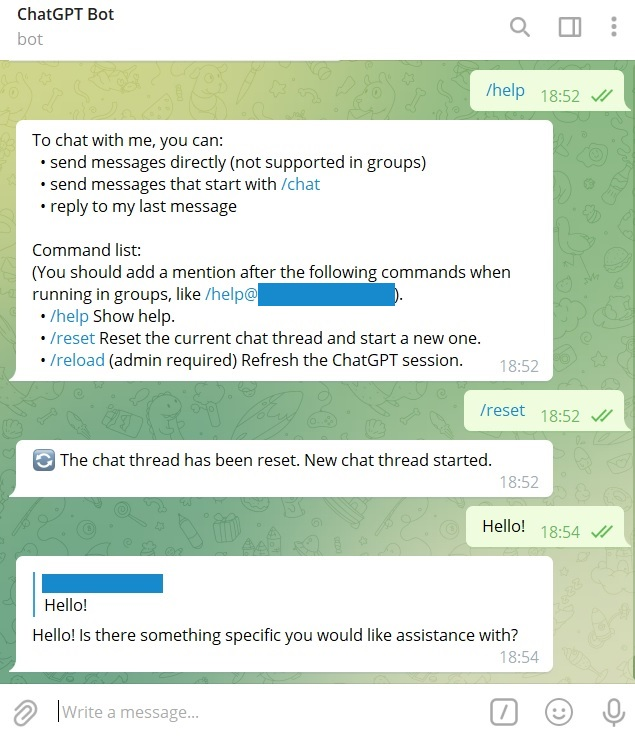
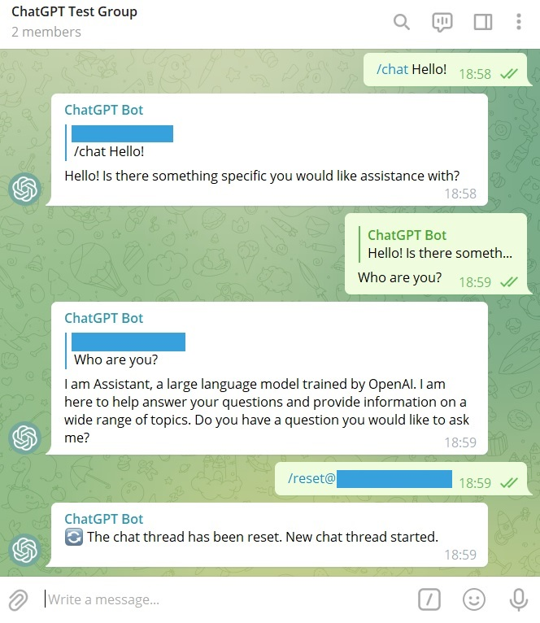

# ChatGPT Telegram 机器人


[English](README.md) | 中文

一个基于 Node.js 的 ChatGPT 电报机器人。支持非浏览器和基于浏览器的 API。

> Fun fact: 这篇中文文档是 ChatGPT 翻译的。

## 更新

<strong>🎉 v2 已发布！</strong>
<details open>
  <summary><b>🔔 2023 年 3 月 10 日 (v2.4.0)</b></summary>

  > - 添加超时机制以防止消息队列被卡住。您可以在配置文件中覆盖默认超时时间。
</details>

<details open>
  <summary><b>🔔 2023 年 3 月 7 日 (v2.3.2)</b></summary>

  > - 您现在可以从 Docker Hub 拉取 [预构建的 Docker 镜像](https://hub.docker.com/r/raineggplant/chatgpt-telegram-bot) 了！
</details>

<details>
<summary><strong>历史更新</strong></summary>
<details>
  <summary><b>🔔 2023 年 3 月 2 日 (v2.3.0)</b></summary>

  > - 支持 [OpenAI 官方 chat completions API](https://platform.openai.com/docs/guides/chat)。
  > - 支持使用自定义的 fetch 函数进行代理。

  我们强烈建议您使用 `official` API。有传言称如果您继续使用 `unofficial` 和 `browser` API，OpenAI 可能会禁止您的账户。
</details>

<details>
  <summary><b>🔔 2023 年 2 月 28 日 (v2.2.0)</b></summary>

  > - 支持消息队列以避免速率限制。
  > - 改善 Markdown 解析。
</details>

<details>
  <summary><b>🔔 2023 年 2 月 22 日 (v2.1.1)</b></summary>

  > - 支持自定义提示前缀和后缀（允许您自定义机器人的身份和行为）。
  > - 支持 Node.js v19。
</details>

<details>
  <summary><b>🔔 2023 年 2 月 19 日 (v2.1.0)</b></summary>

  > 我们已经添加了对 @acheong08 的非官方代理 API 的支持。此 API 使用代理服务器，允许用户绕过 Cloudflare 保护并使用真正的 ChatGPT。请参阅 [使用方法](#使用方法) 获取更多详情。
  >
  > 对于老用户，我们已更新我们的 API 选项。`api.version` 现在变为了 `api.type`，可选项为 `browser`（之前的 `v3`）、`official`（之前的 `v4`）和 `unofficial`。请相应地更新您的配置文件。
</details>

<details>
  <summary><b>🔔 2023 年 2 月 17 日</b></summary>

  > 根据[维护者之一](https://github.com/waylaidwanderer/node-chatgpt-api#updates)的说法，OpenAI 已经修补了这种方法。所以你要么使用带官方模型的无浏览器 Official API（需要付费），要么使用基于浏览器的解决方案。
</details>

<details>
  <summary><b>🔔 2023 年 2 月 15 日</b></summary>

  > 我们发布了 v2.0.0 版本的这个机器人，支持 [非浏览器](https://github.com/transitive-bullshit/chatgpt-api) 和 [基于浏览器](https://github.com/transitive-bullshit/chatgpt-api/tree/v3) 的 API。您可以随时使用配置文件在两个 API 之间切换。此外，我们已经重构了代码库，使其更易于维护和扩展。
  >
  > 对于老用户，您需要从 `.env` 文件切换到 `config/` 文件夹下的 json 文件。
</details>

</details>

## 特点

<table>
  <tr>
    <th>私聊</th>
    <th>群聊</th>
  </tr>
  <tr>
    <td></td>
    <td></td>
  </tr>
</table>

- 支持非浏览器 (官方，非官方) 和基于浏览器的 API
- 支持私聊和群聊
- 在隐私模式下工作 (机器人只能查看特定的消息)
- 基于用户和群组 ID 的机器人访问控制
- 使用命令重置聊天线程并刷新会话
- 使用消息队列以避免速率限制
- “正在输入”提示，Markdown 格式化等
- 绕过 Cloudflare 并自动完成验证码 (适用于基于浏览器的 API)
- 自定义机器人身份和行为 (通过设置 `api.official.systemMessage`)
- 用户友好的日志记录

## 使用方法

### 三种 API 类型之间的区别

> 感谢 @transitive-bullshit 制作了这个易于理解的表格！

| 类型         | 免费？ | 稳定？ | 质量？              |
| ------------ | ------ | ------ | ------------------- |
| `official`   | ❌ 否   | ✅ 是   | ✅ 真实 ChatGPT 模型 |
| `unofficial` | ✅ 是   | ☑️ 可能 | ✅ 真实 ChatGPT      |
| `browser`    | ✅ 是   | ❌ 否   | ✅ 真实 ChatGPT      |

- `official`: 使用 OpenAI 官方的 chat completions API，默认基于 `gpt-3.5-turbo` 模型 (官方、稳定，但不免费)
- `unofficial`: 使用一个非官方的代理服务器以绕过 Cloudflare 访问 ChatGPT 网页版的后端 API (使用真实的 ChatGPT，非常轻量级，但依赖第三方服务器并且受速率限制)
- `browser` (不推荐使用): 使用 Puppeteer 访问官方的 ChatGPT 网页版 (使用真实的ChatGPT，但非常不稳定、耗费资源，并且容易出错)

> **Warning**
>
> 有传言称，如果您继续使用 `unofficial` 和 `browser` API，OpenAI 可能会封禁您的账户。请自行决定是否使用。

### 启动服务器

#### 选项 1: Node
要开始使用，请按照以下步骤操作：

1. 克隆这个项目。
2. 在 `config/` 文件夹下创建 `local.json`。可以将 `config/default.json` 复制为模板。
3. 按照文件中的说明修改 `local.json`。`local.json` 中的设置将覆盖 `default.json` 中的默认设置。
  - 如果您想使用非浏览器的官方 API，请将 `api.type` 设置为 `official`。然后提供您的[OpenAI API密钥](https://platform.openai.com/overview)和其他设置。您可以参考[这里](https://github.com/transitive-bullshit/chatgpt-api#usage---chatgptapi)获取更多详细信息。请注意，这将消耗您的账户余额。
  - 如果您想使用非浏览器的非官方 API，请将 `api.type` 设置为 `unofficial`。然后提供您的 OpenAI 访问令牌 ([如何获取访问令牌?](https://github.com/transitive-bullshit/chatgpt-api#access-token)) 和其他设置。您可以参考[这里](https://github.com/transitive-bullshit/chatgpt-api#usage---chatgptunofficialproxyapi)获取更多详细信息。
  - 如果您想使用基于浏览器的 API (不推荐)，请将 `api.type` 设置为 `browser`。然后提供 OpenAI / Google / Microsoft 凭证和其他设置。您可以参考[这里](https://github.com/transitive-bullshit/chatgpt-api/tree/v3#authentication)和[这里](https://github.com/transitive-bullshit/chatgpt-api/blob/v3/docs/classes/ChatGPTAPIBrowser.md#parameters)获取更多详细信息。请确保您已安装基于 Chromium 的浏览器。

然后，您可以使用以下命令启动机器人：

```shell
pnpm install
pnpm build && pnpm start
```

#### 选项 2: Docker

请按以下步骤开始：

1. 创建一个名为 `config` 的文件夹，并在其中创建一个 `local.json` 文件。您可以按照“选项 1: Node”中的说明自定义设置。
2. 运行以下命令启动机器人：

    ```shell
    docker run -d -v ./config:/app/config raineggplant/chatgpt-telegram-bot:latest
    ```

    这将拉取最新的只支持无浏览器 API 的镜像。如果您想使用基于浏览器的 API，则可以将标签后缀添加为 `-browser`，例如 `raineggplant/chatgpt-telegram-bot:latest-browser`。


### 在 Telegram 中与机器人聊天

要在 Telegram 中与机器人聊天，您可以：

- 向机器人直接发送消息（不支持在群组中使用）
- 发送以指定命令开头的消息（例如 `/chat` 或您在 JSON 配置文件中指定的命令）
- 回复机器人的最后一条消息

> **Note** 在将机器人添加到群组之前，请确保已启用机器人的隐私模式，否则它将回复群组中的每条消息。

该机器人还有几个命令。

- `/help`：显示帮助信息。
- `/reset`：重置当前聊天线程并开始新线程。
- `/reload`（需要管理员权限，只适用于基于浏览器的 API）：刷新 ChatGPT 会话。

> **Note** 在群组中使用命令时，请确保在命令之后包含提及，例如`/help@chatgpt_bot`。


## 高级选项

### 在无头服务器上运行基于浏览器 API 的机器人

您可以使用 [Xvfb](https://www.x.org/releases/X11R7.6/doc/man/man1/Xvfb.1.xhtml) 在无头服务器上创建虚拟帧缓冲区，并运行以下程序：

```shell
xvfb-run -a --server-args="-screen 0 1280x800x24 -nolisten tcp -dpi 96 +extension RANDR" pnpm start
```

我们建议您使用 Google 验证，以避免复杂的登录 Recaptchas。如果您使用 OpenAI 帐户，则可能需要使用 nopecha 或 2captcha 或手动解决Recaptcha（通过使用 x11vnc 连接到显示服务器）。有关 CAPTCHA 解决的更多详细信息，请参阅[API存储库](https://github.com/transitive-bullshit/chatgpt-api/tree/v3#captchas)。

## 鸣谢

- [ChatGPT API](https://github.com/transitive-bullshit/chatgpt-api)：ChatGPT API 的 Node.js 客户端。
- [ChatGPT](https://github.com/acheong08/ChatGPT)：Python 版本的 ChatGPT API。
- [Node.js Telegram Bot API](https://github.com/yagop/node-telegram-bot-api)：NodeJS 的 Telegram Bot API。
- [🤖️ chatbot-telegram](https://github.com/Ciyou/chatbot-telegram)：另一个 Telegram ChatGPT 机器人。

## 许可证

[MIT License](LICENSE).

**如果您觉得这个项目有用，请给它一个 star ⭐。**
